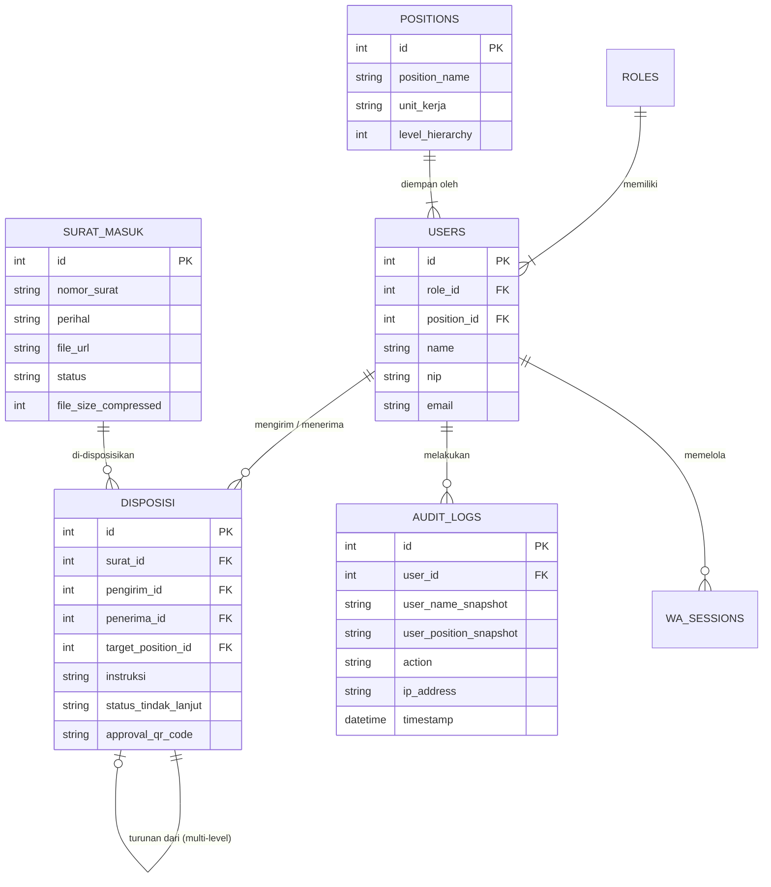

# PRD — Project Requirements Document

## 1. Overview
Pengadilan Agama saat ini membutuhkan sistem informasi yang terintegrasi untuk mengatasi masalah tersebarnya berbagai aplikasi dan proses birokrasi manual, khususnya dalam pengelolaan surat menyurat dan disposisi. 

Sistem Portal Terpadu Pengadilan Agama dirancang sebagai sebuah **Multi-Application Dashboard**. Portal ini berfungsi sebagai pintu gerbang tunggal (Single Sign-On) yang aman. Untuk tahap pertama, fokus pengembangan adalah modul **Manajemen Surat Menyurat** (Surat Masuk, Surat Keluar, dan Disposisi Internal) yang mendukung sistem *multi-level disposition*. Lebih jauh lagi, sistem ini dibangun dengan arsitektur **Hybrid Modular Monolith** yang sangat terukur (scalable) sehingga siap menampung penambahan aplikasi atau modul baru di masa depan (seperti Keuangan, Kepegawaian, Aset) tanpa harus merombak sistem yang sudah ada, namun tetap dalam satu infrastruktur yang efisien.

Sistem ini mengadopsi hierarki organisasi resmi Pengadilan Agama dengan fleksibilitas penugasan, memisahkan antara **Role** (Fungsi Sistem) dan **Position** (Jabatan Struktural/Fungsional), serta mendukung targetisasi individu secara spesifik dalam alur disposisi. Sistem juga dilengkapi dengan fitur pelaporan otomatis untuk evaluasi kinerja (LKjIP) serta keamanan dokumen tingkat lanjut.

## 2. Requirements
- **Hak Akses Dinamis (RBAC & Visibility Control):** 
    - Sistem harus mengenali dan membatasi akses berdasarkan peran pengguna. 
    - **Pemisahan Admin:** Terdapat perbedaan tegas antara **Super Admin** (kontrol infrastruktur, modul, dan database global) dan **Admin** (operasional user, mapping jabatan, reset password).
    - **Visibility Control:** Super Admin dapat mengatur visibilitas ikon aplikasi/modul di dashboard berdasarkan Role tertentu (misal: Modul Keuangan hanya muncul untuk Bagian Keuangan).
- **Standar Keamanan & Regulasi:** Harus memenuhi tata kelola Sistem Pemerintahan Berbasis Elektronik (SPBE), mengikuti panduan keamanan BSSN/Pusintek Mahkamah Agung, serta enkripsi data sensitif.
- **Audit Trail Komprehensif:** Segala aktivitas dalam sistem harus tercatat dalam log aktivitas yang tidak dapat dihapus (immutable). Log wajib mencakup: **Nama Pengguna, Jabatan, IP Address, Aksi, Entitas, dan Timestamp**.
- **Notifikasi Multi-Channel (Zero-Cost):** Pemberitahuan disposisi atau tugas baru harus dikirimkan secara real-time melalui WhatsApp (menggunakan library open-source gratis), Email, dan Push Notification.
- **Infrastruktur Fleksibel & Lokal:** Sistem dirancang untuk penempatan lokal (*On-Premise*) di server internal Pengadilan Agama namun menggunakan pola arsitektur modern (API Gateway) untuk skalabilitas di masa depan.
- **Identity Management Terpisah:** Logika manajemen identitas (User, Role, Position) harus terpisah dari logika bisnis modul aplikasi untuk keamanan dan kemudahan maintenance.
- **Pelaporan Kinerja:** Sistem wajib menyediakan fitur rekapitulasi otomatis untuk kebutuhan laporan kinerja instansi (LKjIP).
- **Keamanan Dokumen:** Dokumen sensitif harus memiliki proteksi unduh, watermarking dinamis, dan validasi internal melalui QR Code.

## 3. Core Features
1. **Gerbang Utama & App Hub (Dynamic Dashboard):** Halaman login terpusat yang aman. Setelah masuk, pengguna melihat *dashboard* berisi ikon-ikon aplikasi (modul) yang **muncul secara dinamis** sesuai jabatan dan role mereka.
2. **Manajemen Surat Masuk & Keluar:** Fasilitas bagi staf persuratan untuk meregistrasi, mengunggah hasil *scan* arsip digital, serta mengelola penomoran persuratan instansi.
3. **Disposisi Digital Berjenjang (*Multi-Level Disposition*):** Fitur utama di mana surat dari Ketua dapat diturunkan ke Wakil, lalu diteruskan kembali ke Hakim atau Kepaniteraan. Mendukung **Personalized Targeting** (Pilih Bagian -> Pilih Jabatan -> Pilih Nama Individu).
4. **Pelaporan Tindak Lanjut (*Closed-Loop System*):** Penerima disposisi akhir dapat mengunggah file balasan atau catatan bukti bahwa tugas telah diselesaikan, sehingga status surat berubah menjadi "Selesai/Ditindaklanjuti".
5. **Sistem Notifikasi Terpadu (WhatsApp Gratis):** Pengiriman alert otomatis via Email, Push App, dan **WhatsApp**. Integrasi WhatsApp menggunakan library open-source (seperti `whatsapp-web.js` atau Baileys) yang bekerja dengan pemindaian QR Code, sehingga tidak memerlukan biaya langganan API resmi.
6. **Log Audit & Keamanan:** Perekaman otomatis setiap aksi pengguna beserta detail identitas lengkap (Nama & Jabatan), waktu (timestamp), dan alamat IP, untuk kebutuhan investigasi atau audit kepatuhan.
7. **Mapping Jabatan & User:** Fitur khusus bagi Admin untuk memetakan banyak pengguna (Multi-User) ke dalam satu jenis jabatan (Misal: 5 orang Hakim Anggota), memungkinkan pemilihan individu spesifik saat disposisi.
8. **Fitur Rekap & Pelaporan Otomatis:** Sistem dapat menghasilkan laporan statistik persuratan secara berkala (bulanan/tahunan) yang mencakup jumlah surat masuk, rata-rata waktu penyelesaian disposisi, dan status disposisi per bagian untuk kebutuhan evaluasi kinerja (LKjIP).
9. **Integrated Document Viewer & Internal Approval:** Sistem menyediakan panel pratinjau (preview) dokumen secara langsung di dalam aplikasi dengan kontrol unduh. Dokumen dianggap sah secara sistem melalui verifikasi akun pimpinan dan log aktivitas, serta menyematkan **QR Code unik** sebagai tanda validasi internal tanpa perlu integrasi pihak ketiga berbayar.
10. **Pencarian Global dengan Indexing (Global Search with Indexing):** Fitur pencarian universal di dashboard utama yang memungkinkan Pimpinan atau Hakim mencari surat lama secara instan berdasarkan potongan kata di perihal, nomor surat, atau pengirim. Menggunakan mekanisme **Indexing Database** (seperti PostgreSQL Full-Text Search) untuk memastikan performa tinggi dan hasil pencarian relevan bahkan dengan ribuan hingga jutaan record.
11. **Auto-Compressor File:** Sistem dilengkapi modul kompresi otomatis saat pengunggahan. Jika staf mengunggah hasil *scan* PDF berukuran besar (misal >20MB), sistem akan mengecilkan ukuran file secara otomatis sebelum disimpan ke server lokal untuk menghemat ruang penyimpanan (*storage efficiency*).
12. **Indikator Status Koneksi WhatsApp:** Pada panel Admin, terdapat indikator real-time yang menunjukkan status koneksi WhatsApp (`whatsapp-web.js`), apakah "Online" atau "Terputus". Fitur ini memudahkan tim IT untuk memantau sesi WA dan melakukan pemindaian QR Code ulang jika diperlukan agar notifikasi tetap terkirim.

## 4. User Flow
Berikut adalah alur kerja utama untuk fitur manajemen surat dan disposisi berjenjang dengan logika targetisasi individu:

1. **Registrasi Surat:** **Staf Persuratan** menerima surat fisik, melakukan *scanning*, masuk ke portal, dan meregistrasi data surat masuk. File otomatis dikompresi jika berukuran besar.
2. **Telaah Awal:** Surat secara otomatis masuk ke akun **Sekretaris / Panitera**. Mereka membuka notifikasi, menelaah isi surat, dan memberikan catatan pengantar sebelum diteruskan ke atas.
3. **Instruksi Pimpinan:** Surat naik ke akun **Ketua Pengadilan**. Ketua membaca surat tersebut dan memberikan instruksi disposisi secara digital.
    - *Logika Targeting:* Ketua memilih Unit Kerja (misal: Kepaniteraan) -> Memilih Jabatan (misal: Panitera Muda) -> **Memilih Nama Individu** (Misal: Bp. Ahmad) agar notifikasi masuk ke akun personal yang tepat.
    - *Logika Bypass:* Ketua memiliki opsi untuk memberikan instruksi langsung ke Staf Pelaksana di bawah tanpa melalui jenjang menengah jika sifatnya mendesak.
    - *Keamanan Dokumen:* Ketua dapat mengatur izin unduh (Download Permission) saat mengirim disposisi. Dokumen yang disetujui akan memiliki QR Code validasi internal.
4. **Disposisi Berjenjang:** Pejabat yang menerima instruksi dari Ketua dapat menindaklanjutinya sendiri, ATAU mendisposisikan kembali tugas tersebut kepada bawahannya beserta catatan khusus.
5. **Eksekusi & Penyelesaian:** **Staf/Eksekutor** terakhir menerima tugas, menyelesaikan instruksi, lalu mengubah status disposisi menjadi "Selesai" sambil melampirkan berkas hasil tindak lanjut atau memo/catatan penyelesaian.
6. **Pencarian & Monitoring:** Pimpinan dapat menggunakan fitur **Global Search** kapan saja untuk menemukan surat tertentu berdasarkan kata kunci tanpa perlu membuka menu arsip secara manual.

## 5. Architecture
Untuk memastikan skalabilitas, keamanan, dan efisiensi pemeliharaan, sistem ini menggunakan arsitektur **Hybrid Modular Monolith** dengan **API Gateway** sebagai entry point tunggal. Pendekatan ini bertujuan untuk mengintegrasikan berbagai modul aplikasi dalam satu ekosistem portal tanpa mengorbankan independensi kode. 

**Identity Module Separation:** Modul autentikasi dan manajemen identitas (User, Role, Position) dibangun terpisah secara logika dari modul bisnis (Surat, Keuangan, dll) untuk memastikan keamanan akses terpusat.

**Modular Independence:** Setiap modul bisnis (Surat, Kepegawaian, Keuangan) memiliki boundary kode yang jelas. Jika Pengadilan Agama ingin menambah aplikasi baru, modul tersebut dikembangkan secara terisolasi dalam kode yang sama dan dideploy dalam satu infrastruktur yang efisien, tanpa kompleksitas orkestrasi mikroservis yang berlebihan.

**Digital Approval Internal:** Modul Manajemen Surat & Disposisi dirancang dengan validasi internal berbasis akun dan Audit Trail. Dokumen keluar akan menyematkan QR Code unik untuk verifikasi keaslian tanpa bergantung pada penyedia Tanda Tangan Elektronik berbayar.

**Local Backup Redundancy:** Arsitektur penyimpanan file mendukung *Local Network Sync*. File disimpan di server utama dan disinkronisasikan otomatis ke media penyimpanan fisik lain (Hardisk Eksternal/Server Backup) dalam jaringan LAN yang sama untuk keamanan data berlapis tanpa biaya cloud.

**Search Indexing:** Database dikonfigurasi dengan indexing khusus (Full-Text Search) pada kolom perihal, nomor surat, dan pengirim untuk mendukung fitur Global Search yang performa tinggi.

API Gateway bertindak sebagai "polisi lalu lintas" yang menangani request routing, autentikasi (SSO), dan keamanan terpusat.

```mermaid
flowchart TD
    User([Pengguna: Staf, Hakim, Ketua, Admin]) --> Portal[Frontend: Dynamic Dashboard]
    Portal --> APIGateway{API Gateway\n(Routing, SSO, Rate Limiting)}
    
    APIGateway --> BackendApp[Backend Application\n(Hybrid Modular Monolith)]
    
    subgraph ModularMonolith [Struktur Modul Internal]
        direction TB
        IdentityModule[Modul: Identity & RBAC<br/>(User, Role, Position)]
        MailModule[Modul: Manajemen Surat & Disposisi<br/>(Internal Approval & QR)]
        AuditModule[Modul: Audit Trail Log]
        ReportModule[Modul: Pelaporan & Statistik]
        SearchModule[Modul: Global Search Indexing]
        FutureModule[Modul Masa Depan: HR / Keuangan]
    end
    
    BackendApp --- ModularMonolith
    
    BackendApp --> NotifService[Layanan Notifikasi: WA (Open Source), Email, Push]
    BackendApp --> LocalDB[(Database Server On-Premise<br/>with Full-Text Index)]
    BackendApp --> LocalBackup[Local Network Sync<br/>(Hardisk/Server Backup)]
    
    style APIGateway fill:#f9db42,stroke:#333,stroke-width:2px
    style BackendApp fill:#bbdefb,stroke:#333,stroke-width:2px
    style IdentityModule fill:#d1c4e9,stroke:#333,stroke-width:2px
    style FutureModule stroke-dasharray: 5, 5, fill:#e5e7eb
```

## 6. Database Schema
Untuk mendukung RBAC, pemisahan Jabatan, skema disposisi berjenjang yang Targeted, serta keamanan dokumen, berikut adalah struktur database utama yang dirancang.

*Daftar Tabel Utama:*
- **roles:** Menyimpan tingkatan hak akses sistem (Super Admin, Admin, User Biasa). (Kolom: `id`, `role_name`, `permissions_json`, `visibility_config`)
- **positions:** Menyimpan daftar jabatan struktural/fungsional organisasi. (Kolom: `id`, `position_name`, `unit_kerja`, `level_hierarchy`)
- **users:** Menyimpan informasi kredensial dan data diri pegawai. Terhubung ke Role dan Position. (Kolom: `id`, `name`, `nip`, `email`, `password_hash`, `role_id`, `position_id`, `is_active`)
- **surat_masuk:** Menyimpan metadata dan file arsip surat yang diregistrasi pendaftaran. (Kolom: `id`, `nomor_surat`, `tanggal_terima`, `pengirim`, `perihal`, `file_url`, `status`, `file_size_original`, `file_size_compressed`)
- **disposisi:** Menyimpan rantai riwayat lembar disposisi (*parent-child*) dengan target spesifik. (Kolom: `id`, `surat_id`, `pengirim_id`, `penerima_id`, `target_position_id`, `instruksi`, `parent_disposisi_id`, `status_tindak_lanjut`, `file_balasan`, `allow_download`, `approval_qr_code`)
- **audit_logs:** Catatan riwayat aktivitas yang tidak bisa dimodifikasi. (Kolom: `id`, `user_id`, `user_name_snapshot`, `user_position_snapshot`, `action`, `entity`, `ip_address`, `timestamp`)
- **wa_sessions:** Menyimpan status sesi WhatsApp untuk monitoring admin. (Kolom: `id`, `session_name`, `status`, `last_connected`, `qr_code_data`)



## 7. Tech Stack
Mengingat ini adalah sistem pemerintahan skala instansi yang dipasang *On-Premise* dan membutuhkan tingkat keamanan tinggi serta pelacakan relasional yang ketat (audit trail, disposisi berjenjang), berikut adalah susunan teknologi yang direkomendasikan untuk mendukung arsitektur Modular Monolith:

- **Frontend:** Next.js (React), Tailwind CSS, shadcn/ui (Untuk membangun antarmuka dashboard yang interaktif, modern, ringan, dan mendukung *Dynamic Dashboard* serta *Document Viewer*).
- **Backend / API Routing:** Node.js (NestJS) dibangun sebagai **Modular Monolith**. Setiap modul (Surat, Auth, Audit, HR, Report) memiliki boundary kode yang jelas namun berjalan dalam satu proses aplikasi yang efisien di belakang API Gateway.
- **ORM / Database Management:** Drizzle ORM (Cepat, ringan, dan sangat *type-safe*).
- **Database:** PostgreSQL (Direkomendasikan dibanding SQLite untuk skala instalasi server pemerintah *On-Premise* karena lebih tangguh, mendukung keamanan ketat, relasi kompleks jabatan, pengelolaan *audit trail* yang masif, dan **Full-Text Search** untuk fitur Global Search).
- **Authentication:** Better Auth / NextAuth (Sistem login yang aman dan mendukung ekstensi multi-role, terintegrasi dengan API Gateway dan Modul Identity).
- **WhatsApp Integration:** `whatsapp-web.js` atau `Baileys` (Library open-source untuk mengirim notifikasi WA gratis via QR Code scan tanpa API berbayar).
- **File Compression:** `sharp` atau `pdf-lib` (Library open-source untuk kompresi otomatis gambar dan PDF saat upload).
- **Deployment:** Docker (Single Container untuk Backend Monolith). Ditempatkan di dalam server fisik/On-Premise instansi untuk keamanan jaringan tertutup dan pemeliharaan yang terstandarisasi. Image Docker disimpan di private registry untuk recovery.

## 8. User Roles & Permissions Matrix
Matriks berikut mendefinisikan hak akses berdasarkan 6 Level pengguna dalam ekosistem Pengadilan Agama, termasuk hak akses dokumen.

| Level | Role / Jabatan | Akses Modul | Wewenang Spesifik | Akses Preview | Hak Download |
| :--- | :--- | :--- | :--- | :--- | :--- |
| **1. Administrator** | **Super Admin** | Semua Modul (Full) | Kontrol infrastruktur, tambah/hapus modul, konfigurasi API Gateway, akses database global, edit semua data, **Monitor WA Status**. | Ya | Ya |
| | **Admin (IT/Kepegawaian)** | Manajemen User, Referensi | Membuat user, reset password, mapping User ke Jabatan, konfigurasi unit kerja, **Manage WA Session**. | Ya | Ya |
| **2. Pimpinan** | **Ketua & Wakil Ketua** | Surat, Dashboard Monitoring, Semua Aplikasi (Read/Monitor) | Disposisi utama (tahap 1), instruksi berjenjang, pantau kinerja real-time, **Bypass Disposisi** (langsung ke staf bawah), **Global Search**. | Ya | Ya |
| **3. Middle Management** | **Panitera & Sekretaris** | Modul Perkara, Modul Administratif | Telaah surat, catatan pengantar, meneruskan disposisi ke pejabat struktural bawahannya. | Ya | Ya |
| | **Pejabat Struktural** (Panitera Muda, Kasubag) | Modul Teknis Sesuai Bagian | Menerima disposisi, meneruskan tugas spesifik ke Staf Fungsional/Pelaksana. | Ya | Terbatas (Sesuai disposisi) |
| **4. Fungsional & Teknis** | **Hakim Anggota** | Modul Perkara, Surat | Menerima disposisi pimpinan terkait penanganan perkara, **Global Search**. | Ya | Terbatas (Sesuai tugas) |
| | **Panitera Pengganti** | Modul Persidangan | Disposisi administrasi persidangan dan Berita Acara. | Ya | Terbatas (Sesuai tugas) |
| | **Jurusita / Jurusita Pengganti** | Modul Eksekusi & Relaas | Disposisi pemanggilan dan eksekusi. | Ya | Terbatas (Sesuai tugas) |
| | **Pranata Komputer, Analis, Arsiparis, dll** | Modul Sesuai Bidang (IT, Arsip, SDM, Keuangan) | Mengelola data teknis sesuai jabatan fungsional (IT, Hukum, SDM, Keuangan). | Ya | Terbatas (Sesuai tugas) |
| **5. Pelaksana (Staf)** | **Pengelola Perkara, BMN, Data, Admin** | Modul Operasional Harian | Input data, verifikasi, dukungan administrasi umum, eksekusi tugas Disposisi Akhir. | Ya | Tidak (Default: Off) |
| **6. Tenaga Pendukung** | **PPNPN** (Security, Driver, Kebersihan) | Modul Terbatas (Read-Only) | Melihat Surat Tugas jalan, jadwal piket/jaga. | Ya (Terbatas) | Tidak |

## 9. Interaction Logic & Security Protocol
Bagian ini menjelaskan logika bisnis kritis dan protokol keamanan yang harus diterapkan dalam sistem.

### 9.1 Logika Disposisi & Targeting
1.  **Nested Selection:** Saat melakukan disposisi, pengguna tidak hanya memilih "Jabatan" (misal: Kasubag Umum), tetapi harus memilih **Individu Spesifik** (misal: Bp. Budi) jika jabatan tersebut diisi oleh banyak orang (Multi-User). Sistem akan melakukan query: `Select User WHERE position_id = X AND is_active = true`.
2.  **Bypass Mechanism:** Pimpinan (Ketua/Wakil) memiliki flag khusus `can_bypass_hierarchy`. Jika diaktifkan, surat dapat langsung didisposisikan ke Level Pelaksana/Staf tanpa harus melalui jenjang Panitera/Kasubag, untuk keperluan mendesak.
3.  **Closed-Loop Validation:** Surat hanya dianggap "Selesai" jika penerima disposisi paling akhir mengunggah bukti tindak lanjut dan mengubah status. Status ini akan memicu notifikasi balik ke pengirim disposisi awal.
4.  **Internal Approval:** Dokumen yang telah disetujui pimpinan akan menghasilkan QR Code unik yang tersimpan di database dan ditampilkan pada dokumen digital sebagai tanda validasi internal.

### 9.2 Protokol Keamanan, Backup & Disaster Recovery
1.  **Immutable Audit Trail:** Tabel `audit_logs` bersifat *Append-Only*. Tidak ada fungsi `UPDATE` atau `DELETE` yang diizinkan pada tabel ini dari sisi aplikasi.
2.  **Snapshot Identity:** Pada saat log dibuat, sistem harus menyimpan *snapshot* Nama dan Jabatan pengguna (`user_name_snapshot`, `user_position_snapshot`) ke dalam tabel log. Ini penting untuk audit sejarah jika ternyata data user diubah atau user dinonaktifkan di kemudian hari.
3.  **Session Management:** Sesi login akan otomatis *timeout* setelah periode tidak aktif tertentu. Akses API Gateway wajib memvalidasi token pada setiap request.
4.  **Data Encryption:** Data sensitif (password, NIP, detail surat tertentu) harus dienkripsi saat diam (at rest) di database dan saat dikirim (in transit) menggunakan TLS/SSL.
5.  **Local Network Sync Backup:** Selain disimpan di server lokal utama, setiap file surat yang diunggah wajib disinkronisasikan secara otomatis ke media penyimpanan fisik lain (Hardisk Eksternal/Server Backup) dalam jaringan LAN yang sama. Ini berfungsi sebagai off-site backup lokal jika terjadi kerusakan pada penyimpanan fisik server utama.
6.  **Automated Database Dump:** Sistem melakukan backup basis data secara otomatis setiap tengah malam (24.00) ke storage berbeda untuk menjamin keberlangsungan data pengadilan.
7.  **Application State Backup:** Versi aplikasi (Docker Image) harus tersimpan di private registry. Jika terjadi error kritis atau kerusakan sistem, Admin dapat melakukan Point-in-Time Recovery untuk mengembalikan kondisi aplikasi dan database ke waktu terakhir sebelum terjadi error.

### 9.3 Mekanisme Delegasi & Plt
1.  **Delegasi Tugas Sementara:** Sistem harus menyediakan fitur pengaturan delegasi tugas sementara (Plt) oleh Admin. Hal ini memungkinkan pemindahan hak akses dan alur disposisi dari satu personil ke personil pengganti selama periode tertentu (misal: diklat atau dinas luar) tanpa merubah data jabatan permanen di database.
2.  **Periodic Access:** Akses delegasi bersifat temporal dengan tanggal mulai dan berakhir yang jelas, setelah itu hak akses kembali secara otomatis kepada pemegang jabatan asli.

### 9.4 Document Security & Watermarking
1.  **Permission-Based Downloading:** Hak untuk mengunduh file (Download Permission) adalah parameter tambahan di dalam database surat/disposisi (`allow_download`). Pengirim disposisi dapat mencentang opsi "Izinkan Unduh" saat mengirimkan surat ke bawahan. Jika tidak dicentang, penerima hanya bisa melihat dokumen via viewer.
2.  **View-Only Mode:** Pada mode ini, tombol "Download", "Print", dan fungsi "Klik Kanan > Save As" dinonaktifkan secara sistem melalui kontrol frontend dan header keamanan HTTP.
3.  **Visual Security:** Pada mode View-Only, sistem dapat menyematkan watermark dinamis (berupa Nama User & Timestamp) di atas dokumen yang sedang dilihat untuk mencegah pengambilan data melalui screenshot atau fotografi layar.

### 9.5 Global Search Logic
1.  **Indexing:** Database PostgreSQL dikonfigurasi dengan `tsvector` pada kolom `perihal`, `nomor_surat`, dan `pengirim` untuk memungkinkan pencarian cepat berdasarkan potongan kata.
2.  **Performance:** Query pencarian harus memanfaatkan index yang tersedia untuk memastikan respons di bawah 1 detik meskipun terdapat ribuan record surat.
3.  **Security:** Hasil pencarian hanya menampilkan surat yang sesuai dengan hak akses (RBAC) pengguna yang sedang login.

### 9.6 WhatsApp Monitoring Logic
1.  **Session Heartbeat:** Sistem secara berkala mengecek status sesi `whatsapp-web.js`.
2.  **Admin Alert:** Jika status terdeteksi "Terputus", indikator di Dashboard Admin berubah menjadi merah dan memberikan notifikasi kepada Super Admin untuk melakukan scan QR Code ulang.

## 10. Prinsip Zero-Cost Infrastructure
Seluruh teknologi yang digunakan dalam sistem ini (Software Stack, Library, dan Layanan Tambahan) wajib bersifat Open Source atau Self-Hosted. Sistem tidak boleh memiliki ketergantungan pada layanan pihak ketiga yang memerlukan biaya langganan bulanan (subscription) atau biaya per penggunaan (pay-per-use). Seluruh data dan trafik harus berputar di dalam server lokal kantor.

- **No Cloud Subscription:** Tidak menggunakan Google Drive API, AWS, Azure, atau layanan cloud berbayar lainnya untuk penyimpanan atau komputasi.
- **No Paid API:** Tidak menggunakan WhatsApp Business API berbayar, SMS Gateway berbayar, atau layanan E-Sign komersial.
- **Self-Hosted Only:** Semua layanan (Database, Backend, Frontend, WhatsApp Bridge) berjalan di infrastruktur milik instansi (On-Premise).